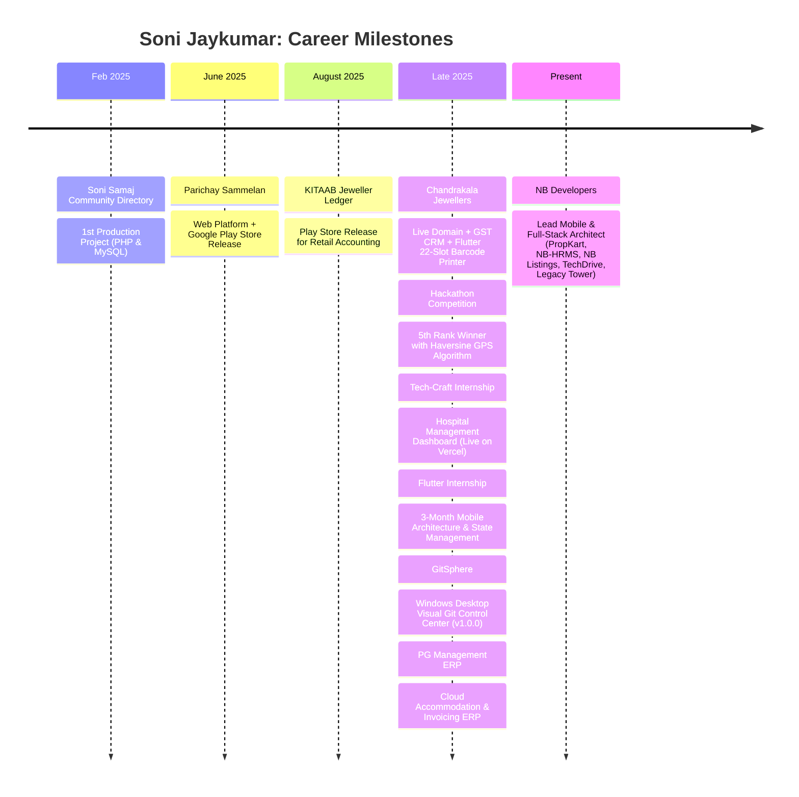

# Soni Jaykumar Hasmukh
### Lead Mobile & Full-Stack Architect | Flutter, React & Offline-First Systems

<div align="left">

[](https://portfolio-iota-nine-7b2v5ah7u8.vercel.app/)
[](https://propkart.nbpropertytech.com)
[](https://crm.nbdeveloper.co.in)
[](https://play.google.com/store/apps/details?id=com.hssolutiontech.ParichaySammelan)
[](https://wa.me/917990361109)
[](https://linkedin.com/in/sonijay1908)
[](https://github.com/JAYU0812)

</div>

---

## 🎯 Executive Overview

I am **Soni Jaykumar**, a Lead Mobile & Full-Stack Software Engineer based in Ahmedabad, India, specializing in **Flutter**, **React**, **Node.js**, **Supabase / PostgreSQL**, and **high-performance Offline-First architectures**.

* **Live Personal Portfolio**: [https://portfolio-iota-nine-7b2v5ah7u8.vercel.app/](https://portfolio-iota-nine-7b2v5ah7u8.vercel.app/)
* Currently serving as **Lead Mobile & Full-Stack Architect** at **NB Developers (NB Property Tech)**, engineering enterprise platforms including **PropKart Real-Estate CRM & OS (v2.1.1, evolved from NB Listings)**, **NB-HRMS & ERP (live on crm.nbdeveloper.co.in)**, **TechDrive**, and high-converting marketing campaign engines.

---

## ⚡ Production Telemetry & System Benchmarks

| Architectural Layer | Implementation Technology | Production Benchmark | Operational Impact |
|---|---|---|---|
| **Local Read Latency** | Embedded Isar NoSQL (v3.1.0) | **2ms – 8ms** | Perceived zero-latency (0ms wait); zero blocking UI spinners |
| **Batch Write Speed** | Isar Atomic Transactions | **10ms – 25ms** | Groups 100+ property listings & mutation outboxes without UI frame drops |
| **Lead Ad Ingestion** | Meta Graph API & Webhook Triad | **&lt; 1 Second** | Instant lead routing from Facebook / Instagram ads to telecaller desks |
| **Socket Batching** | Phoenix Channels & Supabase Realtime | **100ms Debounce** | Eliminates UI thread lockups during high-volume server sync events |
| **Outbox Replay** | Deterministic Server-Wins Queue | **Deterministic Sync** | Guarantees zero data loss or stale overwrites when agents leave basement offline zones |

---

## 🚀 Featured Production Software

### 1. [PropKart — Enterprise Property CRM & OS (v2.1.1, Build 11)](https://propkart.nbpropertytech.com)
* **Role**: Lead Mobile & Full-Stack Architect @ NB Developers
* **Tech Stack**: Flutter, Dart, BLoC & Riverpod, Node.js, Express.js, Supabase, PostgreSQL, Isar NoSQL, Meta Ads Graph API, Phoenix WebSockets
* **Live App URL**: [https://propkart.nbpropertytech.com](https://propkart.nbpropertytech.com)
* **Highlights**:
  - Offline-First client with embedded Isar NoSQL achieving 2–8ms reads across thousands of property records.
  - Evolved from the original NB Listings foundation into a comprehensive operating system for real estate desks with timeline-driven GPU ShaderMask brand transitions.
  - Multi-channel ingestion triad routing Meta Lead Ads (<1s push) and Google Sheets into telecaller CRM queues with automated +91 normalization and deduplication.
  - Lead Understanding Engine computing 0–100% completeness score and 1-tap WhatsApp deep-links.

### 2. [NB-HRMS — Enterprise CRM, HRMS & ERP Platform](https://crm.nbdeveloper.co.in)
* **Platform**: Full-Stack Enterprise System (Next.js 14, Hasura, PostgreSQL, Express 5, Flutter)
* **Live Production URL**: [https://crm.nbdeveloper.co.in](https://crm.nbdeveloper.co.in)
* **Tech Stack**: Next.js 14 App Router, TypeScript, Tailwind CSS, Express 5, Prisma v6, PostgreSQL 15, Hasura GraphQL Engine, Redis, AES-256-CBC, Cloudinary, LiveKit WebRTC, Whisper AI
* **Highlights**:
  - Live production deployment at `crm.nbdeveloper.co.in` serving enterprise internal operations.
  - Field-level AES-256-CBC encryption for government identity documents (Aadhaar and PAN) at rest.
  - Append-only audit logging engine calculating field-level diffs on every sensitive write for compliance.
  - Hasura GraphQL layer with unified PostgreSQL relationship stitching and LiveKit WebRTC video calling.

### 3. TechDrive — Enterprise Document & Cloud Storage Management
* **Platform**: Internal Cloud Vault (Flutter, Firebase, FL Chart)
* **Tech Stack**: Flutter 3.x, BLoC, Firebase Authentication, Cloud Firestore, FL Chart, Dio
* **Highlights**:
  - Interactive storage distribution charts (FL Chart) categorizing Documents, Blueprints, Media, and Archives.
  - Departmental access control with multi-tier permissions (Viewer / Editor / Admin) and 2-stage recycle recovery bin.

### 4. Legacy Tower Campaign — Luxury Infrastructure Discovery Portal
* **Platform**: Commercial Campaign Portal (Flutter Web, Firestore, Webhooks)
* **Tech Stack**: Flutter Web, Cloud Firestore, Firebase Analytics, Google Sheets Webhook Engine, GoRouter
* **Highlights**:
  - Interactive luxury unit configurator with sub-2s Google Sheets webhook routing directly into telecaller queues.
  - Integrated Firebase Analytics tracking investor brochure downloads and walkthrough engagement.

### 5. GitSphere — Visual Git Control Center & Repository Intelligence
* **Platform**: Windows Desktop Application (v1.0.0 Release)
* **Tech Stack**: Flutter Desktop, Dart, Riverpod 2.6+, GoRouter 14.8+, SQLite (`sqflite_common_ffi`), GitHub REST API v3, Native Process Runner, Inno Setup 6, Win32 / DWM
* **Distribution**: Inno Setup 6 Installer (`GitSphere-v1.0.0-Setup.exe`, 12.07 MB) + Portable ZIP (SHA-256)
* **Highlights**:
  - Replaces terminal friction with an interactive 4-stage visual pipeline: **Working Tree &rarr; Staging Area &rarr; Local Commit Branch &rarr; GitHub Cloud Remote**.
  - 1-click SQLite multi-account GitHub credential switcher eliminating terminal re-authentication collisions.
  - Collaborator Push/Pull sync ledger attributing *'I pushed'* vs *'Collaborator pushed'*.
  - Semantic README engine parsing shell commands into 1-click executable actions (Setup, Dev, Test, Build).

### 3. [Chandrakala Jewellers — Commercial Platform & ERP Suite](https://chandrakalajewellers.in)
* **Tech Stack**: React, Flutter Desktop (`baseapp`), Tailwind CSS, Supabase, Custom GST Billing Engine, Thermal Barcode Printer, HUID Tracking
* **Live Domain**: [https://chandrakalajewellers.in](https://chandrakalajewellers.in)
* **Highlights**:
  - Production digital showroom with automated click-to-inquire WhatsApp ordering pipeline.
  - Proprietary GST billing CRM calculating metal purity, hallmark fees, making charges, and CGST/SGST invoices.
  - Dedicated Flutter desktop application printing 22-slot staggered barcode jewellery tags (139.7 x 190.5mm) with central tail strips for rings and chains, integrated with HUID tracking.

### 4. [Parichay Sammelan — Web & Android App](https://play.google.com/store/apps/details?id=com.hssolutiontech.ParichaySammelan&pcampaignid=web_share)
* **Status**: Published on Google Play Store (`com.hssolutiontech.ParichaySammelan`)
* **Tech Stack**: React, Android Studio, PHP, MySQL, Razorpay Gateway, Dynamic QR Verification
* **Google Play Link**: [View on Play Store](https://play.google.com/store/apps/details?id=com.hssolutiontech.ParichaySammelan&pcampaignid=web_share)
* **Highlights**: Community matchmaking portal and mobile app with secure ticket checkouts and high-speed on-ground QR venue verification.

### 5. [KITAAB — Jeweller Daily Ledger System](https://play.google.com/store/apps/details?id=com.jeweller.ledger&pcampaignid=web_share)
* **Status**: Published on Google Play Store (`com.jeweller.ledger`)
* **Tech Stack**: Android Studio, PHP, MySQL, Ledger Accounting Engine, Google Play Console
* **Google Play Link**: [View on Play Store](https://play.google.com/store/apps/details?id=com.jeweller.ledger&pcampaignid=web_share)
* **Highlights**: Intuitive mobile accounting ledger replacing traditional paper *bahi-khata* registers with daily debit/credit reconciliation and customer statement PDF export.

### 6. Hostel & PG Accommodation Management ERP
* **Tech Stack**: React, Supabase PostgreSQL, jsPDF & AutoTable, XLSX Engine, Tailwind CSS
* **Highlights**: Full-scale accommodation ERP managing resident KYC onboarding, bed allocations across floors, and automated PDF fee receipts with monthly spreadsheet reporting.

### 7. [Smart Geofenced Attendance System](https://attend-system.wuaze.com)
* **Award**: 5th Rank in Hackathon Competition
* **Tech Stack**: JavaScript, Haversine Spherical Distance Formula, Dynamic QR Code System, PHP, MySQL
* **Highlights**: Anti-proxy geolocation check-in system coupling cryptographic time-based rolling QR tokens with spherical Haversine trigonometric validation ($d = R \cdot c$).

### 8. [Hospital Management Dashboard](https://hospital-dashboard-woad-gamma.vercel.app/)
* **Platform**: Live on Vercel (Tech-Craft Internship)
* **Tech Stack**: React.js, Node.js, Tailwind CSS, Component State Architecture
* **Highlights**: Clinical operations platform with Doctor directory cards, patient record filtering, appointment scheduling, and real-time bed occupancy analytics.

### 9. [Soni Samaj Community Directory](https://sonisamaj.wuaze.com)
* **Milestone**: Foundational 1st Project (February 2025)
* **Tech Stack**: PHP, MySQL, Relational Database Modeling, Multi-Parameter Search Engine
* **Highlights**: Digital community directory establishing multi-attribute family hierarchies and location-based discovery across Gujarat.

---

## 🛠 Technical Competencies

```
Mobile & Desktop : Flutter, Flutter Desktop (Win32/DWM), Dart, Isar NoSQL, BLoC, Riverpod, Android Studio
Frontend (Web)   : React 19, JavaScript (ES6+), TypeScript, Tailwind CSS v4, Vite, Responsive Architecture
Backend & APIs   : Node.js, Express.js, PHP, RESTful APIs, Phoenix WebSockets, Meta Ads Graph API
Databases        : Isar NoSQL (Local DB), SQLite (FFI), Supabase, PostgreSQL, MySQL, Relational Schema Design
Dev & Tooling    : Git & GitHub, Inno Setup 6, Thermal Barcode Label Printing, Postman, Vercel
```

---

## 📈 Engineering Journey (Feb 2025 – Present)



---

## 💻 Local Development Setup

```bash
# 1. Clone the repository
git clone https://github.com/JAYU0812/portfolio.git

# 2. Enter workspace
cd portfolio

# 3. Install dependencies
npm install

# 4. Start local development server
npm run dev

# 5. Run linting verification
npm run lint

# 6. Compile production build
npm run build
```

---

## 📬 Contact & Inquiries

* **WhatsApp**: [+91 79903 61109](https://wa.me/917990361109) *(Fastest response)*
* **Email**: [jay0812soni@gmail.com](mailto:jay0812soni@gmail.com)
* **LinkedIn**: [linkedin.com/in/sonijay1908](https://linkedin.com/in/sonijay1908)
* **GitHub**: [github.com/JAYU0812](https://github.com/JAYU0812)
* **Location**: Ahmedabad, Gujarat, India

---
<div align="center">
  <sub>Engineered by <strong>Soni Jaykumar Hasmukh</strong> • Built with React 19, Vite & Tailwind CSS v4</sub>
</div>
